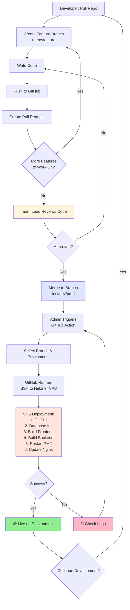

```mermaid
flowchart TD
    A[Developer: Pull Repo] --> B[Create Feature Branch<br/>name/feature]
    B --> C[Write Code]
    C --> D[Push to GitHub]
    D --> E[Create Pull Request]
    
    E --> F{More Features<br/>to Work On?}
    F -->|Yes| B
    
    F -->|No| G[Team Lead Reviews Code]
    G --> H{Approved?}
    H -->|No| C
    H -->|Yes| I[Merge to Branch<br/>test/dev/prod]
    
    I --> J[Admin Triggers<br/>GitHub Action]
    J --> K[Select Branch & Environment]
    
    K --> L[GitHub Runner:<br/>SSH to Hetzner VPS]
    
    L --> M[VPS Deployment:<br/>1. Git Pull<br/>2. Database Init<br/>3. Build Frontend<br/>4. Build Backend<br/>5. Restart PM2<br/>6. Update Nginx]
    
    M --> N{Success?}
    N -->|Yes| O[🟢 Live on Environment]
    N -->|No| P[🔴 Check Logs]
    P --> J
    
    O --> Q{Continue Development?}
    Q -->|Yes| A
    
    style G fill:#fff4dd
    style I fill:#dde5ff
    style M fill:#ffe5dd
    style O fill:#90EE90
    style P fill:#FFB6C6
```
